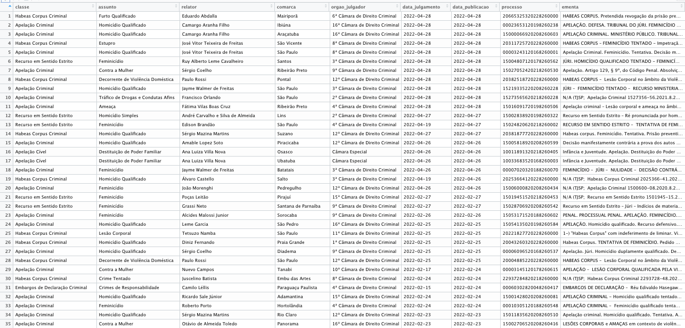

```{r setup, include=FALSE}
knitr::opts_chunk$set(echo = FALSE)
load("base.rda")
library(tibble)
```

O texto inaugural mostra como baixar dados processuais do Tribunal de Justiça de São Paulo (TJSP), bem como, estruturá-los e deixá-los prontos para análise. 


O único pré-requisito é ter noções básicas de programação em [R](https://www.r-project.org/). 

Se você não sabe R e quiser aprender para aplicar à jurimetria, eu mantenho um [curso Jurimetria Aplicada](jurimetria.consudata.com.br).

Inicialmente, vamos instalar o pacote [tjsp](https://tjsp.consudata.com.br), o qual tem todas as ferramentas que você necessita para baixar e organizar os dados do TJSP. Para instalar o pacote tjsp, você deve ter o pacote `remotes` instalado.

```r
remotes::install_package("jjesusfilho/tjsp")
```

O pacote tjsp possui muitas funções para baixar e organizar os dados do TJSP. Ele segue uma sintaxe simples. A maioria das funções começam com tjsp_, seguido do verbo indicador da ação, e.g., baixar, seguido da sigla do repositório. Basicamente, o sistema esaj, responsável por disponibilizar os dados processuais do TJSP em meio eletrônico, usa quatro siglas: 

-  cjsg para consulta de julgados de segundo grau (busca jurisprudencia), [nesta página](https://esaj.tjsp.jus.br/cjsg/resultadoCompleta.do).

- cjpg para consulta de julgados de primeiro grau, [nesta página](https://esaj.tjsp.jus.br/cjpg/).

- cposg para consulta dos dados processuais de segundo grau (dados de capa) e movimentação processual, [nesta página](https://esaj.tjsp.jus.br/cposg/open.do).

- cpopg para consulta dos dados processuais de primeiro grau (dados de capa ) mais movimentação processual, [nesta página](https://esaj.tjsp.jus.br/cpopg/open.do).

Dessa forma, para baixar um consulta jurisprudencial, você usa a função `tjsp_baixar_cjsg()`. Para baixar os dados de capa de um processo de primeiro grau, você usa a função `tjsp_baixar_cpopg()`. Dentro delas, você vai informar os mesmos dados que você informaria na consulta diretamente àquelas páginas. 

## Consulta jurisprudencial

A título de exemplo, vamos baixar alguns julgados de segundo grau. Se você consultar a ajuda da função `tjsp_baixar_cjsg()`, verá que ela tem quase os mesmos parâmetros que você usaria na [página do TJSP](https://esaj.tjsp.jus.br/cjsg/consultaCompleta.do):

```r
library(tjsp)

?tjsp_baixar_cjsg

```

```r
tjsp_baixar_cjsg(
  livre = "",
  aspas = FALSE,
  classe = "",
  assunto = "",
  orgao_julgador = "",
  inicio = "",
  fim = "",
  inicio_pb = "",
  fim_pb = "",
  tipo = "A",
  n = NULL,
  diretorio = "."
)
```

O primeiro argumento da função chama-se livre, o qual corresponde à "Pesquisa livre` na página. Há outros argumentos, como especificação de assunto ou de classe processual. Hoje usaremos somente o primeiro e o argumento n, que indica o número de páginas. Além deles, indicaremos no argumento diretorio, onde queremos baixar as consultas:

Vamos fazer um experimento com a palavra "feminicídio". Vamos criar um diretório chamado femicidio (sem acento) e, dentro dele, um coutro chamado cjsg.

```
dir.create("feminicidio")

dir.create("feminicidio/cjsg")
```

A consulta por feminicídio resultou em mais de 2500 julgados de segundo grau. Vamos baixar apenas as primerias 10 páginas da consulta. Veja abaixo como ficará a consulta.

```r
tjsp_baixar_cjsg(livre = "feminicídio",
                 n  = 10,
                 diretorio = "feminicidio/cjsg")
```

Foram baixados os htmls. Agora vamos ler esses htmls a fim de visualizá-los. O único argumento que você precisa informar é o diretorio onde foram salvos os  htmls.

```r
cjsg <- tjsp_ler_cjsg(diretorio = "feminicidio/cjsg")
```
O resultado é a criação de um dataframe como na imagem abaixo.

```{r layout="l-body-outset", fig.width=4, echo = FALSE}

```

As colunas lidas são as seguintes:

```{r}
glimpse(cjsg)
```


## Consulta processual

O próximo passo é consultar os dados de capa desses processos. No entanto, para automatizar a coleta de dados processuais, é necessário [identificar-se](https://esaj.tjsp.jus.br/sajcas/login) antes com CPF e senha. Se você está cadastrado no esaj, use a função abaixo. Ela abrir um caixa para você incluir seu cpf e senha.

```r
tjsp_autenticar()
```

Vamos criar um diretório chamado "cposg" dentro do diretório "feminicidio".

```
dir.create("feminicidio/cposg")
```

Agora, vamos baixar os processos para a pasta criada. Iremos usar a coluna processo do dataframe cjsg. Para usá-la, basta colocar o cifrão entre o nome do dataframe e o nome da coluna.

```r
tjsp_baixar_cposg(cjsg$processo, diretorio = "feminicidio/cposg")
```

A leitura dos htmls contendo as informações ocorre em quatro pedaços. Iniciamos, nós lemos os dados de capa propriamente ditos, número do processo, magistrado, comarca, vara etc. Em seguida, lemos os dados das partes. Depois lemos a movimentação processual e, por fim, lemos o dispositivo do acórdão. 

Para isso, primeiramente listamos todos os arquivos para então usar o caminho dos arquivos para "parsear" cada um dos grupos de dados mencionados acima. A função abaixo lista todos os htmls.

```r
arquivos <- list.files("feminicidio/cposg",full.names = TRUE)
```

### Dados de capa 
Agora vamos usar esses arquivos para ler os dados de capa.

```r
dados <- tjsp_ler_dados_cposg(arquivos)
```

Abaixo as colunas desses dados:

```{r}

glimpse(dados)

```


### Partes

```r
partes <- tjsp_ler_partes(arquivos)
```


```{r}
glimpse(partes)
```

### movimentação processual

O mesmo fazemos com a movimentação processual.

```r
movimentacao <- tjsp_ler_movimentacao(arquivos)
```

Para visualizar os dados:

```{r}
glimpse(movimentacao)
```


### Dispositivos

Por fim, lemos os dispositivos:

```r
dispositivos <- tjsp_ler_dispositivo(arquivos)
```
E visualizamos:

```{r}

glimpse(dispositivos)

```

Neste tutorial, vimos apenas como baixar e estruturar esses dados em dataframes. Nos próximos, veremos como agregar valor a esses dados. Por exemplo, podemos classificar as decisões se procedentes ou improcedentes. Podemos analisar o tempo do processo.

Há muito mais pela frente. Aguarde os próximos tutoriais.


