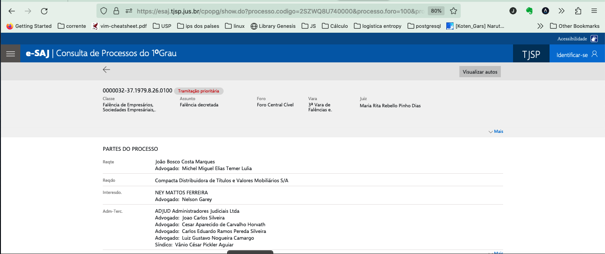

```{r setup, include=FALSE}
knitr::opts_chunk$set(echo = FALSE)
```

## Introdução

Neste tutorial, mostro como realizar requisições http. Ele é parte de material de apoio para o curso de raspagem de tribunais de justiça e administrativos.

Os principais conceitos do protocolo http são apresentados. Antes de iniciar, vamos instalar um pacote muito importante para realizar requisições http, o pacote httr. Falaremos desse pacote extensivamente ao longo desse e dos demais tutoriais.

``` r
install.packages("httr")
```

Além do pacote `httr`, há um outro pacote, que eu mantenho, chamado `JurisMiner`. Ele possui algumas funções auxiliares na requisição. Instale ele também:

``` r
remotes::install_github("courtsbr/JurisMiner")
```

Carregue os dois pacotes:

```{r}
library(httr)
library(JurisMiner)
```

## Requisição http

Quando você escreve o endereço ou url de uma página na barra de endereços do seu navegador, uma série de ações acontecem e muitas informações são transmitidas entre seu computador (cliente) e o computador de quem hospeda a página consultada (servidor).

Essa transmissão de dados entre o servidor que hospeda a página e o seu navegador é controlada pelo protocolo http (Hypertext Transfer Protocol). O protocolo http assegura uma transmissão de dados segura e íntegra.

A esse processo de abrir uma página e visualizar os dados carregados, chamamos de requisição http. A requisição http possui partes, que basicamente são a url, os headers ou cabeçalhos e o corpo.

Além das partes, existe que é a ação ou método de requisição. Há vários métodos de requisição conhecidos, mas dois são de especial relevância para web scraping: GET e POST.

### Métodos

-   GET: O mais comum e serve para requisitar uma representação do recurso desejado. Quando você acessa uma página pela barra de endereço do navegador, geralmente você está usando o GET.

-   POST: Serve para requisitar uma representação recurso também, mas fornece um conjunto de informações que servirão para o processamento do dado ou para serem armazenadas pelo servidor. A requisição POST sempre vem acompanhada do corpo(body), o qual consiste basicamente num formulário, similar à query.

### URL

A URL é o endereço que você digita no seu navegador ou outro endereço gerado a partir da interação com, e.g., uma página de busca. Por exemplo, se você acessar a página de busca de julgados de primeiro grau do TJSP e fizer uma busca qualquer verá que o endereço (url), após a busca, é composto de vários componentes, os quais descreveremos abaixo:

-   Scheme: A versão do protocolo http usada (http, https..)

-   Hostname: O nome de quem hospeda a página e os dados. No presente caso é: esaj.tjsp.jus.br, ou seja, um subdomínio (esaj) do tjsp.jus.br (domínio).

-   port: A porta que permite acesso ao conteúdo. Geralmente esta não é informada diretamente a você, pois ela é conhecida. Geralmente 543 para https e 80 para http.

-   path: Este é o caminho ou subdiretório no servidor onde se encontram as informaçoes ou, ao menos, onde o acesso aos recursos é gerenciado.

-   query: Essa é uma lista longa de informações na forma chave=valor. Ela vem depois de um sinal de interrogação e é composta por informações que o cliente (você) presta ao servidor para que ele opere alguns filtros necessários e fornecer os dados buscados.

Outros componentes: eventualmente, alguns componenentes como params, username, password e fragment são requeridos, mas são excepcionais e dificilmente encontraremos um caso na área jurídica.

Para ajudar com um exemplo, vá para a consulta processual do TJSP [neste link](https://esaj.tjsp.jus.br/cpopg/open.do) e realize uma consulta qualquer. Irei realizar uma pesquisa pelo nome do advogado: Fulano de Tal. Após clicar em Consultar, a barra de endereços do navegador mostrará o seguinte endereço (role a barra para ver o endereço completo)

```         
https://esaj.tjsp.jus.br/cpopg/search.do?conversationId=&cbPesquisa=NMADVOGADO&dadosConsulta.valorConsulta=fulano de tal&cdForo=-1
```

A URL acima contêm os seguintes compontes:

-   scheme: https
-   hostname: esaj.tjsp.jus.br
    -   subdomínio: esaj
    -   nome ou domínio de segundo nível: tjsp
    -   extensão ou domínio de primeiro nível: jus
    -   país: br
-   path ou subdiretório: cpopg/search.do
-   query ou consulta: conversationId=&cbPesquisa=NMADVOGADO&dadosConsulta.valorConsulta=fulano de tal&cdForo=-1

O pacote httr possui uma função importante para desagregar a url em seus componentes:

```{r}
url <- "https://esaj.tjsp.jus.br/cpopg/search.do?conversationId=&cbPesquisa=NMADVOGADO&dadosConsulta.valorConsulta=fulano de tal&cdForo=-1"

url_parseada <- parse_url(url)
url_parseada
```

Se você reproduzir esse processo no RStudio, verá que a url_parseada é uma lista com nove elementos e com a classe "url". Um dos elementos, query, é também uma lista com quatro elementos (pode ser mais): conversationId, cbPesquisa, dadosConsulta.valorConsulta e cdForo. Exceto o primeiro, conversationId, que está fazio, os demais foram preenchidos por você, ao interagir com a interface do esaj.

Você pode alterar a query, por exemplo, para informar o nome de um advogado. Como em toda lista, você usa \$ para acessar os elementos em níveis inferiores da lista.

```{r}
url_parseada$query$dadosConsulta.valorConsulta <- "Michel Temer"
```

Agora você pode reconstruir a url a partir da url_parseada com a função `build_url`:

```{r}
url <- build_url(url_parseada)
url
```

Note que Fulano de Tal foi efetivamente substituído por Michel Temer e, mais, os espaços foram adequadamente preenchidos por %20, que é uma forma mais segura de realizar a requisição. Experimente copiar esta nova url e colá-la na barra de endereços do seu navegador.

### Cabeçalhos

Cabeçalhos ou headers são informações adicionais passadas tanto pelo cliente quanto pelo servidor quando da requisição. Há basicamente três tipos de cabeçalhos: Geral, de requisição e de resposta, dos quais falaremos em seguida. Antes, porém, abra o seu navegador e coloque a url acima ou [Clique aqui](https://esaj.tjsp.jus.br/cpopg/search.do?conversationId=&cbPesquisa=NMADVOGADO&dadosConsulta.valorConsulta=Michel%20Temer&cdForo=-1).



Aperte o botão direito do mouse e selecione a opção inspect. Você verá que irá abrir uma nova janela, que é a interface do desenvolvedor. Em seguida, dê Ctrl+Shift+R (control, shift, R) ou Cmd+Shift+R no Mac. Isso fará que a mesma página seja recarregada. Dentro dessa nova janela, você verá várias abas. Uma delas chama-se Network ou Rede, clique nela. Dentro da aba Network ou Rede, clique em Headers. Se tudo ocorreu bem, você verá algo mais ou menos assim, a depender do seu navegador:


Isso que você vê são os headers, dos quais falaremos em seguida. Tente familiarizar-se com eles, pois serão de extrema relevância para uma requisição http bem sucedida.

#### Cabeçalho geral

O cabeçalho geral contêm informações do status da requisição, a versão http e o tamanho do arquivo transmitido.

##### Status

A informação mais importante quando você realiza uma requisição http é saber o status, pois ele informa a condição do processamento da requisição. Há seis grupos de status, cada um deles inicia um número de 1 a 6 e é formado por três dígitos. Abaixo um resumo dos principais status:

-   Informal, 100 a 102: indica que o servidor não está processando bem a informação.
-   Sucesso, 200 a 208 e 226: indica que a processamento ocorreu bem e o servidor transmitiu os dados solicitados.
-   Redirecionamento, 300 a 308: indica que houve um redirecionamento para outra url ou local.
-   Erro do cliente, 400 a 499: com vários saltos: indica erro de requisição por parte do cliente, e.g., a url não existe, pedido não autorizado etc.
-   Erro do servidor, 500 a 511 e 599: indica erro do servidor,e.g., serviço indisponível, erro interno etc.

##### Tamanho

O tamanho é também mostrado. Se o status for 200, saber o tamanho é importante pois informa quanto tempo pode demorar para finalizar a transmissão e o quanto de memória você tem de reservar para receber esse dado.

#### Cabeçalhos de requisição

Se você rolar a aba headers até o final, verá uma série de pares chave: valor. Esse são os cabeçalhos de requisição. Eles são informações adicionais acerca de quem está realizando a requisição, bem como, o que este espera receber ou mesmo, informações retransmitidas, como os cookies. As mais importantes são accept, content-type, cookies e user-agent.

##### Accept

Esse cabeçalho informa ao servidor qual tipo de média o cliente entende. O tipo de media também é conhecido como MIME(Multipurpose Internet Mail Extensions).

O mais comum é text/html, mas pode ser json, xml, pdf etc.

##### Content-type

Esse cabeçalho existe tanto na requisição quanto na resposta. Na requisição server para informar ao servidor qual o tipo conteúdo está sendo enviado no corpo. Falaremos do corpo mais adiante.

##### Cookies

Os cookies são peças de informação enviadas pelo servidor e armazenadas no navegador do cliente. Falamos disso no [tutorial introdutório](https://raspagem.consudata.com.br/introducao). Por vezes, você precisará pegar o cookie de uma requisição anterior e informá-lo na posterior.

##### User-agent

O user-agent informa ao servidor qual aplicação com sua respectiva versão está realizando a requisição. Por exemplo, pode ser o Chrome, o Firefox, Safari etc. Nas requisições com o httr, a aplicação é um programa chamado curl/versão. O curl é o programa escrito em linguagem C, que roda por trás do httr.

Alguns servidores são restritivos em relação ao user-agent. Por vezes, temos de informar que o user-agent é o mesmo do navegador que estamos usando para inspecionar a página. Por exemplo, eu copiei o user-agent do meu navegador e veio essa informação: "Mozilla/5.0 (Macintosh; Intel Mac OS X 10.15; rv:109.0) Gecko/20100101 Firefox/112.0".

#### Cabeçalhos de resposta

Os cabeçalhos de resposta contêm informações prestadas pelo servidor. O mais importante deles é o content-type, porque ele diz qual o tipo de arquivo estamos importando. Pode ser text/html, application/json, application/pdf etc.

### Corpo

O terceiro elemento da requisição é o corpo. Este, porém, só entra no método POST. O corpo é basicamente o um formulário que você preenche para fornecer informações de filtro para a consulta e/ou outras informações a seu respeito que autorizem acessar aquela informação ou mesmo informações de requisição anterior.

## Exercícios práticos

Vamos aplicar o que aprendemos até aqui realizando requisições a alguns tribunais.

### Julgados de primeiro grau do TJSP

O primeiro passo para realizar uma requisição é interagir com a página e observar como ela opera para retornar os resultados. Passo a passo:

-   Abra a página de busca de julgados de primeiro grau do TJSP [aqui](https://esaj.tjsp.jus.br/cjpg/).

-   Realize uma busca livre, e.g., consulte por "danos morais".

-   Clique com o botão direito do mouse, opte por inspecionar. - Recarregue a página com Ctrl+Shift+R. - Clique na aba Network ou Rede.

-   Verifique o método. No caso, o método é o GET. - Copie que aparece acima. Veja que ela tem uma longa query.

Feito isso, estamos prontos para realizar nossa primeira requisição. O pacote `httr` contêm uma função chamada `GET` que fará a requisição por nós. Eu colei a url abaixo, mas creio que ela é muito longa para ser visualizada numa página.

```{r}
url <- "https://esaj.tjsp.jus.br/cjpg/pesquisar.do?conversationId=&dadosConsulta.pesquisaLivre=danos morais&tipoNumero=UNIFICADO&numeroDigitoAnoUnificado=&foroNumeroUnificado=&dadosConsulta.nuProcesso=&dadosConsulta.nuProcessoAntigo=&classeTreeSelection.values=&classeTreeSelection.text=&assuntoTreeSelection.values=&assuntoTreeSelection.text=&agenteSelectedEntitiesList=&contadoragente=0&contadorMaioragente=0&cdAgente=&nmAgente=&dadosConsulta.dtInicio=&dadosConsulta.dtFim=25/03/2023&varasTreeSelection.values=&varasTreeSelection.text=&dadosConsulta.ordenacao=DESC"
```

Agora vamos parsear essa url e imprimi-la:

```{r}
url_parseada <- parse_url(url)
url_parseada
```

Examine a url_parseada e note que a busca por danos morais está dentro do elemento $query$dadosConsulta.pesquisaLivre. Vamos alterá-lo para danos materiais e reconstruir a url:

```{r}
url_parseada$query$dadosConsulta.pesquisaLivre <- "danos materiais"
```

Com isso, basta reconstruir a url:

```{r}
url <- build_url(url_parseada)
```

Agora podemos realizar a requisição:

```{r}
resposta <- GET(url)
```

Visualize o cabeçalho geral da resposta:

```{r}
resposta
```

Note que o status é 200 (ok ou sucesso). O tamanho pode variar a depender do momento da pesquisa.

Vamos agora realizar a mesma requisição e salvá-la em disco. Para tanto, usamos, dentro da função `GET` uma outra função chamada `write_disk`. A diferença é que agora, não precisamos criar um objeto no R, somente um arquivo no disco.

``` r
GET(url, write_disk("nome_do_arquivo.html"))
```

Abra o arquivo e veja como ficou o resultado.
